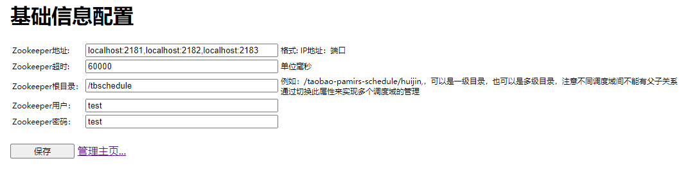
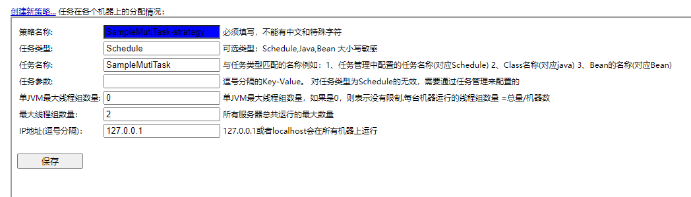
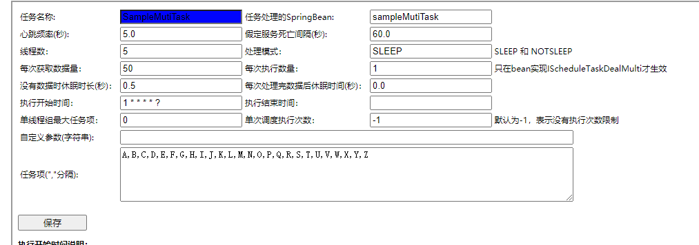

tbschedule是一个支持分布式的调度框架，让批量任务或者不断变化的任务能够被动态的分配到多个主机的JVM中，
在不同的线程组中并行执行，所有的任务能够被不重复，不遗漏的快速处理。基于ZooKeeper的纯Java实现，由Alibaba开源。

### 快速开始

#### 1. 获取代码，并在本地打包
```shell
git clone https://github.com/nmyphp/tbschedule.git

cd tbschedule

mvn package
```
打包之后，在tbschedule-core和tbschedule-console下面会分别生成：

>tbschedule-core\target\tbschedule-core-3.4.0.jar
>
>tbschedule-console\target\tbschedule-console-3.4.0.war

将tbschedule-core发布到你的私服：
```
mvn deploy
```

#### 2. 依赖核心jar包，开发业务代码
在工程中添加如下依赖：
```
<dependency>
    <groupId>com.taobao.pamirs.schedule</groupId>
    <artifactId>tbschedule-core</artifactId>
    <version>3.4.0</version>
</dependency>
```

根据业务需要选择以下两种接口实现你的业务代码：

如果每次只处理一个任务，实现IScheduleTaskDealSingle接口：
```java
/**
 * 简单任务示例
 */
@Slf4j
public class SampleTask implements IScheduleTaskDealSingle<User> {

    @Autowired
    private UserService userService;

    @Override
    public boolean execute(User task, String ownSign) {
        try {
            log.info("开始处理用户：{}", task);
            task.setAge(task.getAge() + 1);
            userService.update(task);
            return true;
        } catch (Exception e) {
            log.error("处理失败：user:{}", task);
            return false;
        }
    }

    @Override
    public List<User> selectTasks(String taskParameter, String ownSign, int taskItemNum,
        List<TaskItemDefine> taskItemList, int eachFetchDataNum) {

        List<User> users = userService.getUsers(taskItemNum, taskItemList, eachFetchDataNum);
        log.info("获取到{}条待处理的用户", users.size());
        return users;
    }

    @Override
    public Comparator<User> getComparator() {
        // 可不实现
        return null;
    }
}
```
如果需要批处理，实现IScheduleTaskDealMulti接口，详细请参考SampleMutiTask。

#### 3. 配置调度
tbschedule需要依赖Zookeeper做分布式调度，所以需要在配置中指定zk的地址，作业根路径等信息。
```java
@Configuration
public class WebAppBeanRegister {

    @Bean(initMethod = "init")
    public TBScheduleManagerFactory tbScheduleManagerFactory(
            @Value("${schedule.zookeeper.address}") String zkConnectString,
            @Value("${schedule.root.catalog}") String rootPath,
            @Value("${schedule.timeout}") String zkSessionTimeout,
            @Value("${schedule.username}") String userName,
            @Value("${schedule.password}") String password,
            @Value("${schedule.isCheckParentPath}") String isCheckParentPath) {
        TBScheduleManagerFactory tbScheduleManagerFactory = new TBScheduleManagerFactory();
        Map<String, String> zkConfig = new HashMap<>();
        zkConfig.put("zkConnectString", zkConnectString);
        zkConfig.put("rootPath", rootPath);
        zkConfig.put("zkSessionTimeout", zkSessionTimeout);
        zkConfig.put("userName", userName);
        zkConfig.put("password", password);
        zkConfig.put("isCheckParentPath", isCheckParentPath);
        tbScheduleManagerFactory.setZkConfig(zkConfig);
        return tbScheduleManagerFactory;
    }
}
```

#### 4. 部署tbschedule管理后台，配置作业调度信息
将上面打包得到的tbschedule-console-3.4.0.war部署到tomcat容器中，比如tomcat端口为8080，访问：

http://localhost:8080/schedule/index.jsp?manager=true

- ZK连接配置


上面配置zk地址为localhost:2181，需要启动一个端口为2181的zk。也可以配置zk集群，以逗号分隔。

- 调度策略



*策略名称*可以自定义，比如SampleTask-strategy。*任务名称*可以自定义，但需要和[任务管理]页面的保持一致。
IP地址：127.0.0.1或者localhost会在所有机器上运行。如果只需要在一台机器上运行，这里就只填写这台机器的ip。

- 是否启用定时任务

如果想要停止某个定时任务，则可以在调度策略中停止。

- 任务管理



*任务名称*可以自定义，但需要和[调度策略]页面的保持一致。任务处理的SpringBean需要和schedule.xml中的beanName保持一致。
任务项的划分：可以有非常多的分配策略和技巧，例如将一个数据表中所有数据的ID按10取模，就将数据划分成了0,1,2,3,4,5,6,7,8,9供10个任务项；将一个目录下的所有文件按文件名称的首字母(不区分大小写)，就划分成了A,B,C,D,E,F,G,H,I,J,K,L,M,N,O,P,Q,R,S,T,U,V,W,X,Y,Z供26个任务项 。

#### 4. 注意事项 
当需要重启应用时，要在控制台上先把机器全部停止，等待线程组消失，否则直接重启应用时会出现新的机器实例，旧的机器实例未能释放分片，导致新的机器获取不到任务分片无法执行，控制台上会显示新、旧线程组均为红色。

#### 5. 分布式高可用高效率保障
- 调度机的高可用有保障
多调度机向注册中心注册后，共享调度任务，且同一调度任务仅由一台调度机执行调度，当前调度机异常宕机后，其余的调度机会接上。

- 执行机(应用服务器)的高可用有保障
多执行机向注册中心注册后，配置执行机单线程（多机总线程为1）执行任务，调度机会随机启动一台执行机执行，当前执行异常机宕机后，调度机会会新调度一台执行机。

- 执行机的并行高效保障
配置执行机多线程且划分多任务子项后，各任务子项均衡分配到所有执行机，各执行机均执行，多线程数据一致性协调由任务项参数区分。

- 弹性扩展失效转移保障
运行中的执行机宕机，或新增执行机，调度机将在下次任务执行前重新分配任务项，不影响正常执行机任务（崩溃的执行机当前任务处理失效）；运行中的调度机宕机或动态新增调度机，不影响执行机当前任务，调度机宕机后动态切换。
